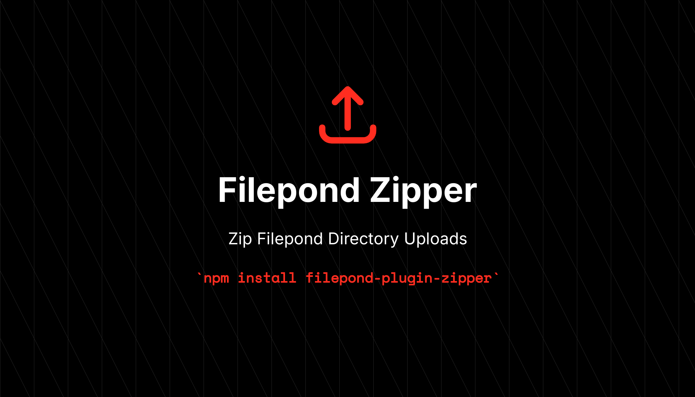

# :gift: Filepond Plugin Zipper



[](https://www.npmjs.com/package/filepond-plugin-zipper)
[](https://www.npmjs.com/package/filepond-plugin-zipper)

This is an extension plugin for [Filepond](https://pqina.nl/filepond/) uploader where you can upload directories as ZIP Files instead of uploading each individual files in them separately.

## :package: Installation

```bash
// NPM:
$ npm install --save filepond-plugin-zipper

// Yarn:
$ yarn add filepond-plugin-zipper
```
### CDN

```html
<script src="https://cdn.jsdelivr.net/npm/jszip@3.10.1/dist/jszip.min.js"></script>
<!-- And... -->
<script src="https://cdn.jsdelivr.net/npm/filepond-plugin-zipper/dist/zipper.min.js"></script>
```

> `JSZip` dependency is required while using via CDN.

## :fire: Usage

This may differ depending upon the Framework you are using, but there is good documentation of how to register plugins in various Frameworks in Filepond website which you can follow.

```js
import FilepondZipper from 'filepond-plugin-zipper';

FilePond.registerPlugin(FilepondZipper());
```

### :star: Hook Support

In many cases, specially while using some reactive frameworks you might like to show some loading screen while it is zipping files which might take some time depending upon the directory size.

In those cases you can pass an options object to `FilepondZipper()` with lifecycle hooks. This allows you to listen to when zipping starts, ends, succeeds, or fails, while the plugin handles adding the resulting zip files to FilePond.

**Example:**
```js
const pond = FilePond.create(...);

FilePond.registerPlugin(FilepondZipper({
  onStart: (directories) => {
    // Fired when zipping process begins
    // e.g. [{ name: "folder1.zip" }]
    console.log("Zipping started for:", directories);
    // Set loading...
  },
  onSuccess: (successes) => {
    // Fired when all zips are successfully generated
    console.log("Zipping succeeded for:", successes);
  },
  onFailed: (failures) => {
    // Fired if any zip fails
    console.error("Zipping failed for:", failures);
  },
  onEnd: (successes, failures) => {
    // Fired when the entire zipping process ends (success or failure)
    console.log("Zipping process completed.");
    // Stop loading...
  }
}));
```

## :microscope: Testing

After Cloning the repository, install all npm dependencies by running: `npm install`.

Then Run Tests:

```bash
$ npm run test
```

## :date: Change log

This repository follows semantic versioning. Please follow the releases to know about what changed.

## :heart: Contributing

Please feel free to contribute ideas and PRs are most welcome.

## :crown: Credits

- [Kazi Mainuddin Ahmed][link-author]
- [All Contributors][link-contributors]

## :policeman: License

The MIT License (MIT). Please see [License File](LICENSE) for more information.

[link-author]: https://github.com/tzsk
[link-contributors]: ../../contributors
